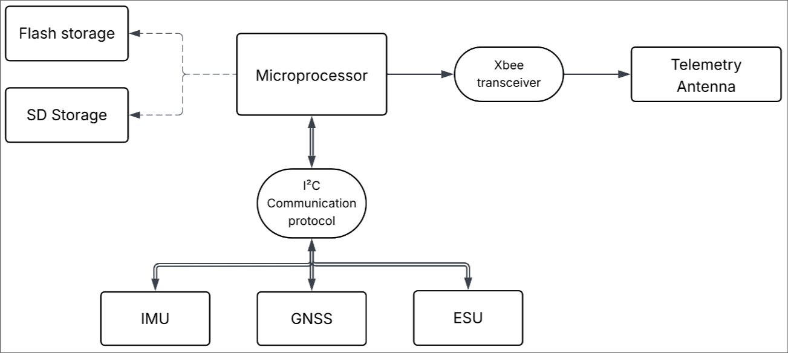

# ITBA Rocketry Team - Avionics&recovery
Documentation of SRAD Flight Computer

---

## Description

- Hardware design and implementation of the 2025 on board flight computer.
- Software used to capture data and transmit it to the ground station.

## FC implementation diagram

## Authors

José Ivan Hertter
Ezequiel Diaz Guzmán